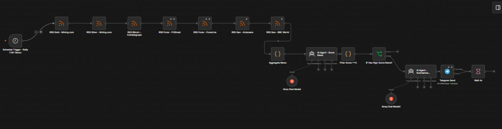
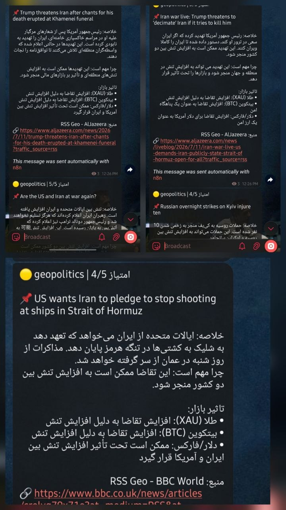

# AI-Powered Financial News Pipeline

سیستم خودکار جمع‌آوری، امتیازدهی و تحلیل اخبار مالی و ژئوپلیتیک با استفاده از n8n و مدل‌های زبانی بزرگ (LLM)، با خروجی خودکار در قالب گزارش تحلیلی به کانال تلگرام.



## 🎯 مسئله

اخبار مالی و ژئوپلیتیک با حجم بالا و از منابع پراکنده منتشر می‌شن، ولی بخش کوچکی از آن‌ها واقعاً روی بازارهایی مثل طلا، بیت‌کوین و فارکس تاثیرگذارند. پیگیری دستی این حجم از اخبار و تشخیص اخبار مهم از نویز، زمان‌بر و ناکارآمد است.

## ✅ راه‌حل

یک pipeline کاملاً خودکار که:
1. اخبار را از چند منبع RSS معتبر (طلا، نقره، بیت‌کوین، فارکس، ژئوپلیتیک) به‌صورت زمان‌بندی‌شده جمع‌آوری می‌کند.
2. با استفاده از یک AI Agent، هر خبر را بر اساس میزان اهمیت و تاثیرگذاری بر بازار امتیازدهی می‌کند (Score 1 تا 5).
3. فقط اخبار با امتیاز بالا (Score >= 3) را فیلتر کرده و برای مرحله بعد ارسال می‌کند.
4. یک AI Agent دوم، برای هر خبر منتخب یک تحلیل ساختاریافته تولید می‌کند: خلاصه، چرایی اهمیت، و تاثیر احتمالی بر XAU (طلا)، BTC (بیت‌کوین) و بازار فارکس.
5. گزارش نهایی به‌صورت خودکار به یک کانال تلگرام ارسال می‌شود.

## 🏗️ معماری

```
RSS Sources (Gold, Silver, Bitcoin, Forex, Geopolitics)
        │
        ▼
   Aggregate News
        │
        ▼
  AI Agent — Score News (1-5)
        │
        ▼
   Filter (Score >= 3)
        │
        ▼
  IF: Has High-Score News?
        │
        ▼
  AI Agent — Summarize & Analyze Market Impact
        │
        ▼
     Telegram Send
```

پروژه به‌صورت زمان‌بندی‌شده (Schedule Trigger) به‌طور روزانه اجرا می‌شود و شامل یک Error Branch جداگانه برای مدیریت خطاهای احتمالی در هر مرحله است.

## 🛠️ تکنولوژی‌ها

| بخش | ابزار |
|---|---|
| Orchestration | n8n |
| مدل زبانی | Groq (LLM) |
| منابع داده | RSS Feeds (Mining.com, Cointelegraph, FXStreet, ForexLive, Al Jazeera, BBC) |
| خروجی | Telegram Bot API |

## 📊 نمونه خروجی



## 🔍 نکات فنی و تصمیمات طراحی

- **دو مرحله AI جدا (Score → Summarize)**: به‌جای یک پرامپت واحد، فرآیند به دو Agent مجزا تقسیم شده تا هم دقت فیلتر اخبار مهم بالاتر برود و هم کیفیت تحلیل نهایی از فیلتر اولیه جدا و متمرکز بماند.
- **Filter آستانه‌ای (Score >= 3)**: برای کاهش نویز و جلوگیری از خستگی اطلاعاتی (information fatigue) در کانال خروجی.
- **Error Branch مجزا**: هر گره اصلی خروجی خطا را جدا از مسیر موفق مدیریت می‌کند تا شکست یک منبع RSS کل pipeline را متوقف نکند.

## ⚠️ درباره کد منبع

فایل JSON ورک‌فلوی n8n به دلیل ملاحظات مربوط به پرامپت‌های اختصاصی و منطق داخلی پروژه، در این مخزن قرار داده نشده است. این ریپو صرفاً برای مستندسازی معماری و نمایش نمونه خروجی است. برای بحث فنی بیشتر یا دمو زنده خوشحال می‌شوم صحبت کنم.

## 📈 توسعه‌های آینده

- افزودن Price Feed زنده (API قیمت لحظه‌ای طلا/بیت‌کوین) برای اعتبارسنجی تحلیل کیفی با داده‌ی کمی واقعی
- افزودن لایه ارزیابی دقت (backtesting) برای سنجش همبستگی امتیاز AI با حرکت واقعی بازار
- پشتیبانی از منابع خبری بیشتر و چندزبانه
